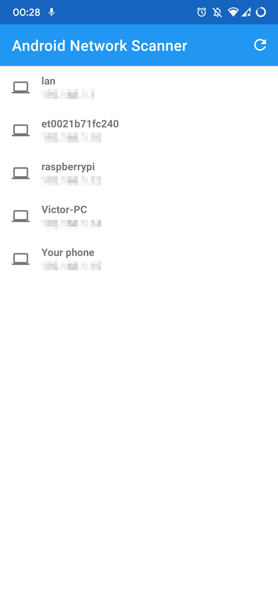
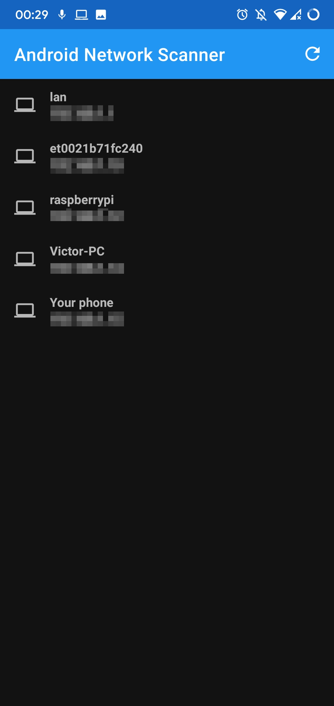

# Android Network Scanner
A lightweight bare-bone Android scanner

Do you sometimes just look for an IP address but don't want to see a ton of informations on the device so you don't know what to choose with all these heavy network scanner like Fing or PortAuthority? Well, that's why I made this app

## Screenshots

 
