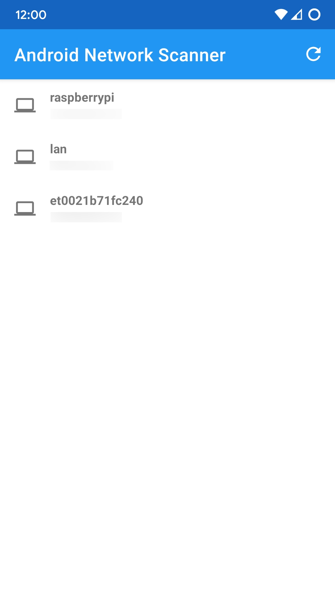
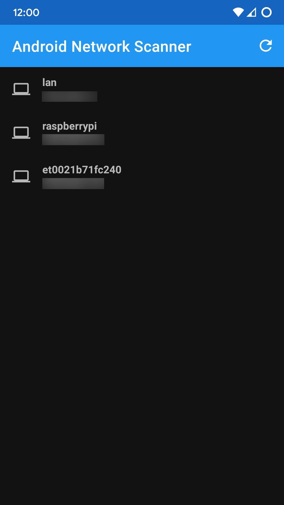

<h1>Android IP Scanner</h1>

A bare-bone android IP scanner

## Feedback

If something doesn't work, feel free to open an [issue](https://github.com/Victor-Bo/android-network-scanner/issues/new/choose)  
If you have ideas / feature requests, or any other discussions / questions, start a discussion [here](https://github.com/Victor-Bo/android-network-scanner/discussions/new)

## Screenshots

 
